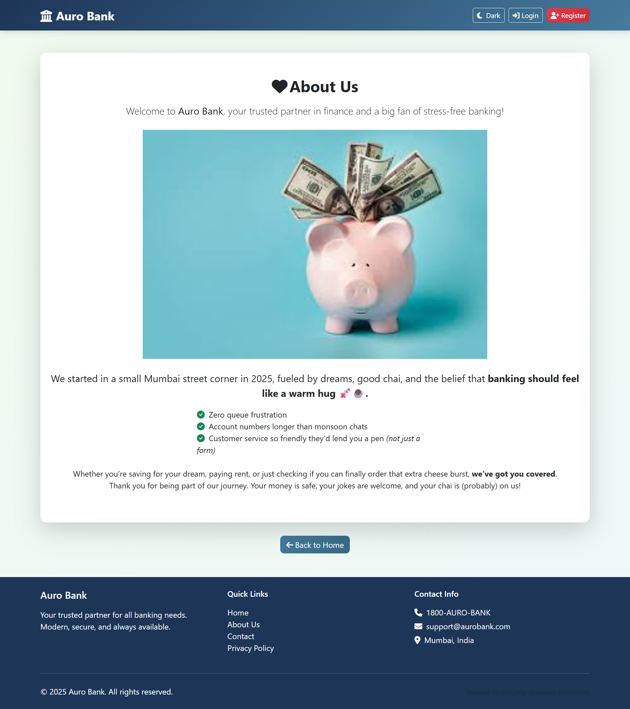

# MVC Bank Application

A comprehensive digital banking application built using Java MVC architecture with JSP/Servlet technology. This modern banking system features user authentication, account management, fund transfers, and administrative controls with both light and dark theme support.

## 🚀 Features

### Core Banking Features
- **User Authentication**: Secure login/logout system with session management
- **Account Management**: Create and manage savings and current accounts
- **Fund Transfers**: Instant money transfers between accounts
- **Transaction History**: Digital passbook with complete transaction records
- **Account Statements**: Generate and view account statements

### Administrative Features
- **Admin Dashboard**: Comprehensive administrative control panel
- **User Management**: Create, view, and manage user accounts
- **Transaction Monitoring**: Monitor all system transactions
- **Account Oversight**: View and manage all customer accounts

### UI/UX Features
- **Dark/Light Mode**: Toggle between modern dark and light themes
- **Responsive Design**: Mobile-first approach for all devices
- **Modern Interface**: Clean, intuitive user experience
- **Secure Banking**: Industry-standard security practices

## 🏗️ Architecture

The application follows the **Model-View-Controller (MVC)** pattern:

- **Model**: Entity classes (`User`, `Account`, `Transaction`)
- **View**: JSP pages with dynamic content rendering
- **Controller**: Servlet controllers handling business logic
- **DAO Layer**: Database access objects for data persistence
- **Service Layer**: Business logic and validation

## 📁 Project Structure

```
mvc-bank-app/
├── src/main/
│   ├── java/com/aurionpro/
│   │   ├── controller/        # Servlet controllers
│   │   ├── dao/              # Data Access Objects
│   │   ├── model/            # Entity classes
│   │   ├── service/          # Business logic services
│   │   ├── filter/           # Security filters
│   │   └── util/             # Utility classes
│   └── webapp/
│       ├── common/           # Shared JSP components
│       ├── *.jsp             # Main JSP pages
│       ├── light.css         # Light theme styles
│       ├── dark.css          # Dark theme styles
│       └── WEB-INF/
└── project-images/           # Application screenshots
```

## 🖼️ Application Screenshots

### Light Theme

*Modern homepage with clean design*


*Secure login interface*


*Comprehensive user dashboard*


*Administrative control panel*


*Detailed account information*


*Fund transfer interface*


*Transfer confirmation screen*


*Digital account statements*

### Dark Theme

*Dark mode homepage*


*Dark theme login*


*Dark mode user dashboard*


*Dark theme admin panel*


*Account details in dark mode*


*Dark mode fund transfer*


*Dark theme statements*

### Additional Pages
 
*User registration (Light/Dark)*

 
*About us page (Light/Dark)*

 
*Contact page (Light/Dark)*

 
*Privacy policy (Light/Dark)*

## 🛠️ Technology Stack

- **Backend**: Java, JSP, Servlets
- **Frontend**: HTML5, CSS3, JavaScript
- **Database**: PostgreSQL (configurable)
- **Build Tool**: Maven
- **Server**: Apache Tomcat
- **Architecture**: MVC Pattern

## 🚀 Getting Started

### Prerequisites
- Java 8 or higher
- Apache Tomcat 9+
- PostgreSQL database
- Maven (for build management)

### Installation

1. **Clone the repository**
   ```bash
   git clone https://github.com/jarjishSiddibapa/mvc-bank-app.git
   cd mvc-bank-app
   ```

2. **Database Setup**
   - Create a PostgreSQL database
   - Update database configuration in the application

3. **Build the project**
   ```bash
   mvn clean compile
   ```

4. **Deploy to Tomcat**
   - Copy the project to Tomcat webapps directory
   - Start Tomcat server

5. **Access the application**
   - Open browser and navigate to `http://localhost:8080/mvc-bank-app`

## 💡 Usage

### For Users
1. **Registration**: Create a new account with personal details
2. **Login**: Access your dashboard with credentials
3. **Account Management**: View account details and balance
4. **Transfer Funds**: Send money to other accounts
5. **View Statements**: Check transaction history and statements

### For Administrators
1. **Admin Login**: Access with administrator credentials
2. **User Management**: Create and manage user accounts
3. **Transaction Monitoring**: View all system transactions
4. **System Administration**: Oversee banking operations

## 🎨 Theme Switching

The application supports both light and dark themes:
- Click the theme toggle button in the header
- Preference is saved in browser storage
- Consistent experience across all pages

## 🔒 Security Features

- Session-based authentication
- Input validation and sanitization
- SQL injection prevention
- Secure password handling
- Admin access controls

## 🤝 Contributing

1. Fork the repository
2. Create a feature branch (`git checkout -b feature/AmazingFeature`)
3. Commit your changes (`git commit -m 'Add some AmazingFeature'`)
4. Push to the branch (`git push origin feature/AmazingFeature`)
5. Open a Pull Request

## 📝 License

This project is licensed under the MIT License - see the [LICENSE](LICENSE) file for details.

## 👤 Author

**Jarjish Siddibapa**
- GitHub: [@jarjishSiddibapa](https://github.com/jarjishSiddibapa)

## 🙏 Acknowledgments

- Built during training at AurionPro
- Inspired by modern banking interfaces
- Thanks to the open-source community

---

*Experience the future of digital banking with our modern, secure, and user-friendly banking application.*